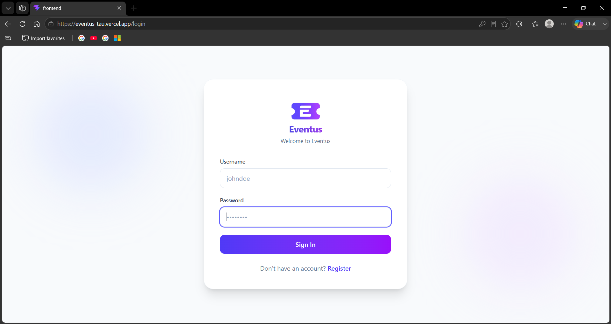
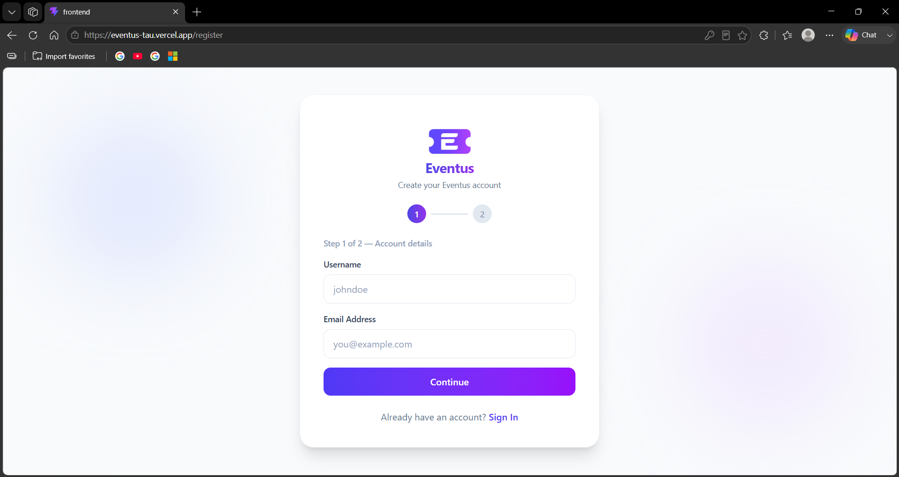
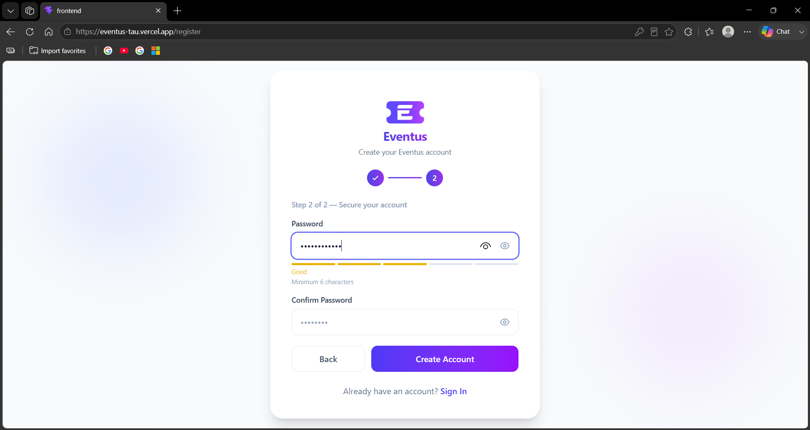
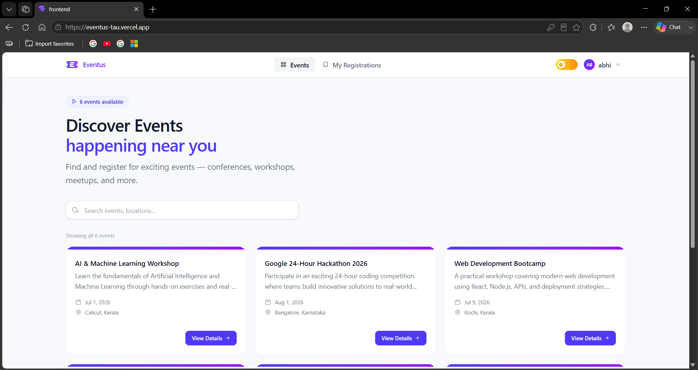
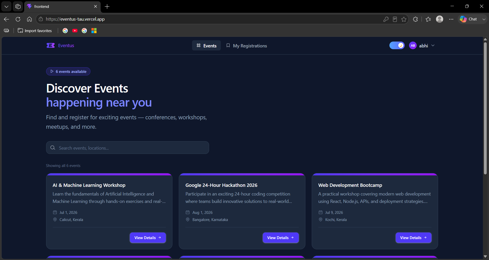
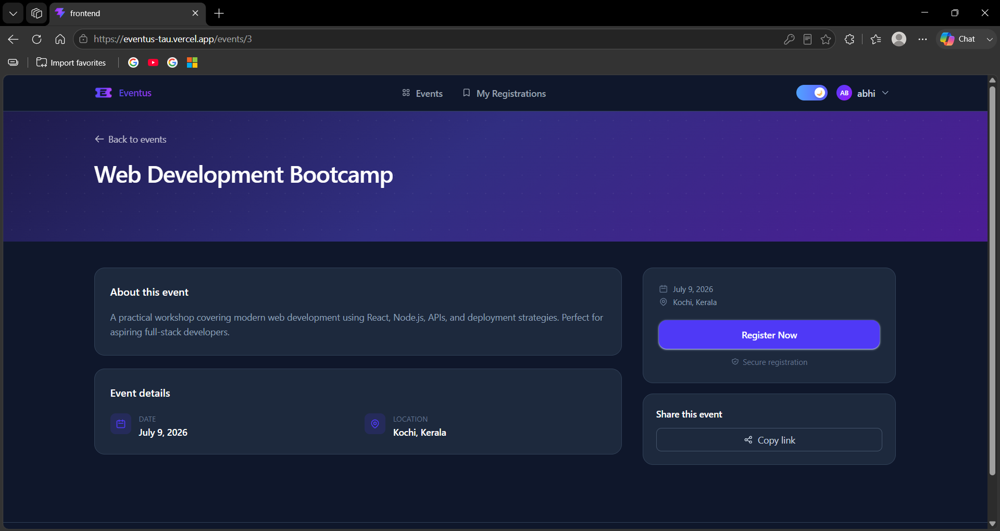
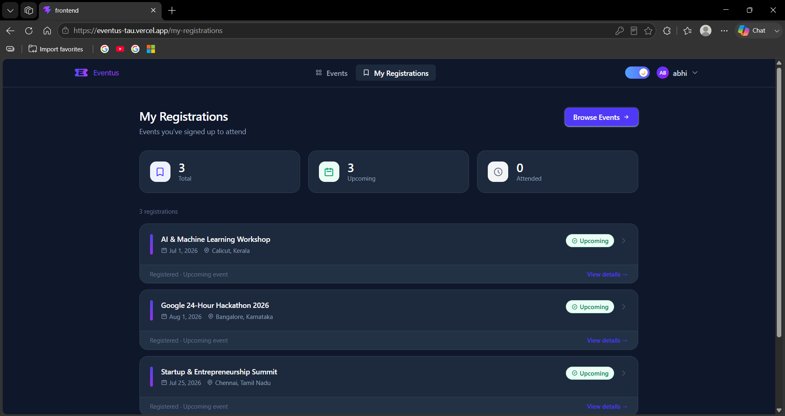

# Eventus

A modern full-stack event registration platform built with React, Django REST Framework, and PostgreSQL.

Users can browse events, view event details, register for events, and manage their registrations through a clean and responsive interface.

## Live Demo

### Frontend

https://eventus-tau.vercel.app

### Backend API

https://eventus-grda.onrender.com

---

## Features

### Authentication

* User Registration
* User Login
* JWT Authentication
* Protected Routes
* Secure Logout

### Event Management

* Browse Available Events
* View Event Details
* Register for Events
* Prevent Duplicate Registrations
* View My Registrations

### User Experience

* Responsive Design
* Search Events
* Dark Mode Support
* Theme Persistence
* Clean Modern UI

### Admin Features

* Django Admin Dashboard
* Create Events
* Edit Events
* Delete Events
* Manage Registrations

---

## Tech Stack

### Frontend

* React
* React Router DOM
* Axios
* Tailwind CSS
* Vite

### Backend

* Django
* Django REST Framework
* Simple JWT Authentication
* Django CORS Headers

### Database

* PostgreSQL

### Deployment

* Frontend: Vercel
* Backend: Render
* Database: Render PostgreSQL

---

## Screenshots

### Login Page



### Register Page




### Events Page (Light Mode)



### Events Page (Dark Mode)



### Event Details



### My Registrations



---

## Installation

### Clone Repository

```bash
git clone <your-repository-url>
cd Eventus
```

### Backend Setup

```bash
cd backend

python -m venv venv

# Windows
venv\Scripts\activate

pip install -r requirements.txt

python manage.py migrate

python manage.py runserver
```

Backend runs at:

```text
http://127.0.0.1:8000
```

### Frontend Setup

```bash
cd frontend

npm install

npm run dev
```

Frontend runs at:

```text
http://localhost:5173
```

---

## API Endpoints

### Authentication

| Method | Endpoint            |
| ------ | ------------------- |
| POST   | /api/register/      |
| POST   | /api/login/         |
| POST   | /api/token/refresh/ |

### Events

| Method | Endpoint                   |
| ------ | -------------------------- |
| GET    | /api/events/               |
| GET    | /api/events/<id>/          |
| POST   | /api/events/<id>/register/ |

### Registrations

| Method | Endpoint               |
| ------ | ---------------------- |
| GET    | /api/my-registrations/ |

---

## Project Structure

```text
Eventus
├── backend
│   ├── accounts
│   ├── events
│   ├── registrations
│   ├── requirements.txt
│   └── ...
│
├── frontend
│   ├── src
│   ├── public
│   └── ...
│
├── Screenshots
│
└── README.md
```

---

## Future Improvements

* Event Categories
* Registration Deadlines
* Email Notifications
* Event Search Filters
* User Profiles

---

## Author

Abhishek S
